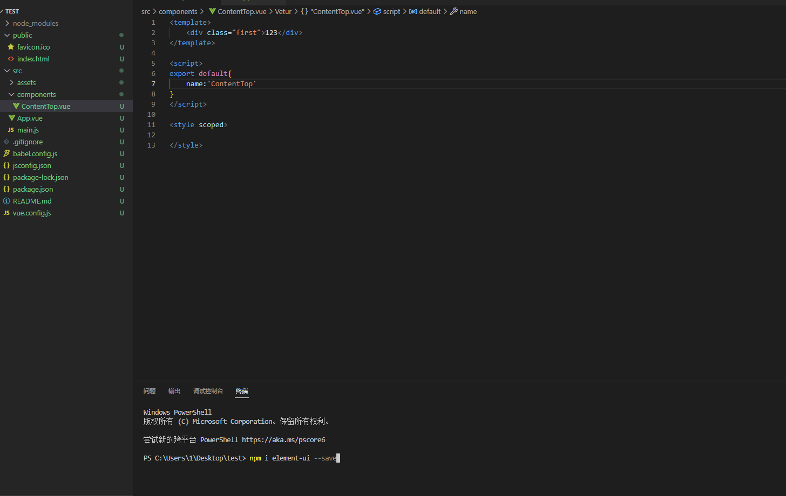
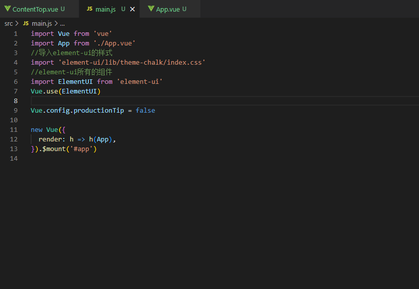
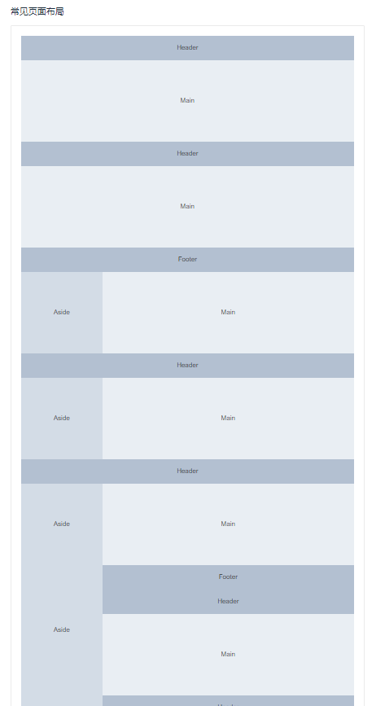

# Element

### 1.element的简介
Element，基于 Vue 2.0 的桌面端组件库，网站快速成型工具 和 桌面端组件库
<br>
**定义**：element ui 就是基于vue的一个ui框架,该框架基于vue开发了很多相关组件,方便我们快速开发页面。由饿了么前端团队开发封装

### 2.element的安装（完整引入）
1.安装element依赖
```
npm i element-ui --save
```

<br>
2.在 main.js 中写入以下内容：
```
//导入element-ui的样式
import ElementUI from 'element-ui';
//element-ui的所有组件
import 'element-ui/lib/theme-chalk/index.css';
Vue.use(ElementUI);
```

<br>
**以上代码便完成了 Element 的引入。需要注意的是，样式文件需要单独引入。**

### 3.Container 布局容器
```
用于布局的容器组件，方便快速搭建页面的基本结构：

<el-container>：外层容器。当子元素中包含 <el-header> 或 <el-footer> 时，全部子元素会垂直上下排列，否则会水平左右排列。
<el-header>：顶栏容器。
<el-aside>：侧边栏容器。
<el-main>：主要区域容器
<el-footer>：底栏容器。
```
